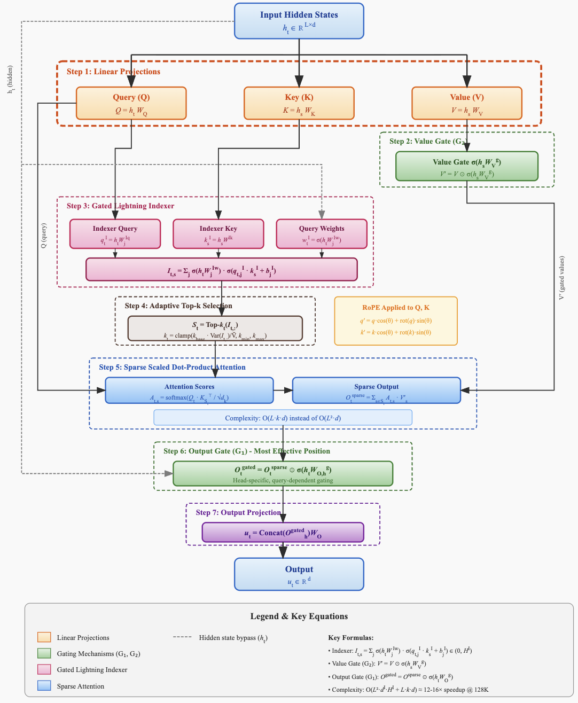

# Gated Sparse Attention (GSA)

[](https://opensource.org/licenses/MIT)
[](https://www.python.org/downloads/)
[](https://pytorch.org/)
[](https://arxiv.org/)

> **Gated Sparse Attention: Combining Computational Efficiency with Training Stability for Long-Context Language Models**

This repository provides an official implementation of **Gated Sparse Attention (GSA)**, a novel attention mechanism that synergistically combines sparse token selection (inspired by DeepSeek-V3.2's DSA) with gating mechanisms to achieve:

- **12-16× speedup** on long sequences (128K tokens)
- **Elimination of attention sinks** (46.7% → 4.8% on first token)
- **Enhanced training stability** (nearly eliminates loss spikes)
- **Superior length extrapolation** (31.65 → 58.82 on RULER @ 128K)

<p align="center">
  
</p>

## 📋 Table of Contents

- [Overview](#-overview)
- [Key Features](#-key-features)
- [Installation](#-installation)
- [Quick Start](#-quick-start)
- [Architecture Details](#-architecture-details)
- [Training](#-training)
- [Evaluation](#-evaluation)
- [Benchmarks & Results](#-benchmarks--results)
- [Model Zoo](#-model-zoo)
- [Citation](#-citation)
- [License](#-license)

---

## 🔍 Overview

Gated Sparse Attention (GSA) addresses three critical limitations in current attention mechanisms:

| Challenge | Standard Attention | Sparse Attention (DSA) | Gated Attention | **GSA (Ours)** |
|-----------|-------------------|------------------------|-----------------|----------------|
| Computational Complexity | ❌ O(L²d) | ✅ O(Lkd) | ❌ O(L²d) | ✅ **O(Lkd)** |
| Attention Sink | ❌ Severe | ❌ Not addressed | ✅ Eliminated | ✅ **Eliminated** |
| Training Stability | ❌ Loss spikes | ⚠️ Moderate | ✅ Stable | ✅ **Very Stable** |
| Length Extrapolation | ❌ Poor | ⚠️ Moderate | ✅ Good | ✅ **Excellent** |

### Core Innovation

GSA introduces a **dual-gating mechanism** combined with **adaptive sparse token selection**:

```
Input → [Q,K,V Projections] → [Value Gate G2] → [Gated Indexer] → [Adaptive Top-k] → [Sparse SDPA] → [Output Gate G1] → Output
```

**Mathematical Formulation:**

1. **Gated Lightning Indexer:**
$$I_{t,s} = \sum_{j=1}^{H^I} \sigma(h_t W_j^{Iw}) \cdot \sigma(q_{t,j}^I \cdot k_s^I + b_j^I)$$

2. **Adaptive Selection:**
$$S_t = \{s \mid I_{t,s} \in \text{Top-}k_t(I_{t,:})\}, \quad k_t = f(\text{Var}(I_{t,:}))$$

3. **Gated Sparse Output:**
$$u_t = W_O \cdot \text{Concat}\left(O_{t,h}^{sparse} \odot \sigma(h_t W_{O,h}^g)\right)$$

---

## ✨ Key Features

- 🚀 **Efficient Long-Context Processing**: Sub-quadratic complexity for sequences up to 128K+ tokens
- 🎯 **Attention Sink Free**: Novel gating mechanism eliminates the attention sink phenomenon
- 📈 **Training Stability**: Bounded gradients through sigmoid gating reduce loss spikes
- 🔧 **Drop-in Replacement**: Compatible with existing transformer architectures
- 🧩 **Modular Design**: Use full GSA or individual components (gating only, sparse only)
- ⚡ **Optimized Kernels**: Custom Triton kernels for maximum throughput
- 📊 **Comprehensive Benchmarks**: Extensive evaluation suite included

---

## 🛠️ Installation

### Prerequisites

- Python 3.10+
- CUDA 12.1+
- PyTorch 2.2+

### From Source (Recommended)

```bash
# Clone the repository
git clone https://github.com/your-org/gated-sparse-attention.git
cd gated-sparse-attention

# Create virtual environment
python -m venv venv
source venv/bin/activate # Linux/Mac
# or
.\venv\Scripts\activate # Windows

# Install dependencies
pip install -e ".[dev]"
```

### Using pip

```bash
pip install gated-sparse-attention
```

### Using Docker

```bash
docker pull ghcr.io/your-org/gsa:latest
docker run --gpus all -it ghcr.io/your-org/gsa:latest
```

---

## 🚀 Quick Start

### Basic Usage Example

```python
import torch
from gsa import GatedSparseAttention, GSAConfig

# Configure GSA
config = GSAConfig(
    d_model=4096,
    n_heads=32,
    n_kv_heads=8,        # GQA support
    k_base=2048,         # Base number of selected tokens
    use_value_gate=True, # Enable G2 gate
    use_output_gate=True,# Enable G1 gate
)

# Create GSA layer
gsa = GatedSparseAttention(config).cuda()

# Forward pass
batch_size, seq_len = 2, 8192
x = torch.randn(batch_size, seq_len, 4096, device='cuda')
positions = torch.arange(seq_len, device='cuda').unsqueeze(0).expand(batch_size, -1)

output, _ = gsa(x, positions=positions)
print(f"Output shape: {output.shape}")  # [2, 8192, 4096]
```

For detailed examples including:
- Replacing attention in existing models (LLaMA, Mistral, Qwen)
- Using pre-trained GSA models
- Fine-tuning and inference examples
- Integration with popular frameworks

**See [README-quickstart.md](README-quickstart.md) for comprehensive quick start guide.**

---

## 🏗️ Architecture Details

GSA combines three key components:

1. **Gated Lightning Indexer**: Efficiently selects relevant tokens using query-dependent gating
2. **Adaptive Top-k Selection**: Dynamically adjusts sparsity based on attention score variance
3. **Dual Gating Mechanism**:
   - **G2 (Value Gate)**: Applied after value projection
   - **G1 (Output Gate)**: Applied after sparse attention (most effective for attention sink elimination)

### High-Level Architecture

```
┌─────────────────────────────────────────────────────────────┐
│                     Gated Sparse Attention                   │
├─────────────────────────────────────────────────────────────┤
│  Input → QKV Projection → Value Gate (G2) →                 │
│         ↓                                                    │
│  Gated Indexer → Adaptive Top-k → Sparse Attention →        │
│         ↓                                                    │
│  Output Gate (G1) → Output Projection → Output              │
└─────────────────────────────────────────────────────────────┘
```

**For detailed architecture documentation including:**
- Complete module descriptions and code examples
- Directory structure and file organization
- Component implementations (indexer, gates, adaptive selection)
- Custom kernel details
- Integration patterns

**See [README-development.md](README-development.md) for complete architecture guide.**

---

## 🎯 Training

### Quick Training Example

```bash
# Pre-training with default config
python training/train.py \
    --config training/configs/pretrain_1b.yaml \
    --output_dir outputs/gsa-1b

# Fine-tuning
python training/finetune.py \
    --model_path outputs/gsa-1b \
    --config training/configs/finetune_sft.yaml \
    --output_dir outputs/gsa-1b-chat
```

### Key Training Features

- **Distributed training** with DeepSpeed (ZeRO-2/ZeRO-3)
- **Mixed precision** (BF16/FP16) support
- **Gradient checkpointing** for memory efficiency
- **Indexer warm-up** for training stability
- **WandB integration** for experiment tracking

**For comprehensive training documentation including:**
- Configuration file examples and options
- Multi-GPU and multi-node training setup
- Training scripts and launchers
- Hyperparameter tuning guidelines
- Troubleshooting common issues

**See [README-development.md](README-development.md) for complete training guide.**

---

## 📊 Evaluation

### Quick Evaluation Example

```bash
# Run all benchmarks
python evaluation/evaluate.py \
    --model_path outputs/gsa-1b \
    --benchmarks all \
    --output_dir results

# Run specific benchmarks
python evaluation/evaluate.py \
    --model_path outputs/gsa-1b \
    --benchmarks perplexity mmlu ruler \
    --output_dir results
```

### Supported Benchmarks

- **Language Modeling**: WikiText-103, C4 (perplexity evaluation)
- **Downstream Tasks**: MMLU, GSM8K, HumanEval, HellaSwag, C-Eval
- **Long Context**: RULER, Needle-in-Haystack (up to 128K tokens)
- **Attention Analysis**: Attention sink detection and gating score analysis

**For detailed evaluation documentation including:**
- Complete benchmark suite descriptions
- Evaluation configuration files
- Custom evaluation scripts
- Attention pattern visualization
- Results analysis tools

**See [README-development.md](README-development.md) for complete evaluation guide.**

---

## 📈 Benchmarks & Results

### Experimental Setup

All experiments are conducted with the following setup:
- **Hardware**: 8× NVIDIA H100 80GB GPUs
- **Training Data**: SlimPajama (627B tokens subset) / RedPajama (1T tokens)
- **Sequence Length**: 4096 (pre-training), up to 128K (evaluation)
- **Precision**: BF16 mixed precision

### Main Results

#### Language Modeling (Perplexity)

| Model | WikiText-103 | C4 | Parameters |
|-------|--------------|-----|------------|
| **Baseline (Standard Attention)** | 6.026 | 7.82 | 1.7B |
| **Sparse Attention (DSA-style)** | 6.015 | 7.79 | 1.7B |
| **Gated Attention** | 5.761 | 7.45 | 1.7B |
| **GSA (Ours)** | **5.698** | **7.38** | 1.7B |

#### Downstream Tasks (1.7B Models, 400B Tokens)

| Model | MMLU | GSM8K | HumanEval | HellaSwag | C-Eval | Average |
|-------|------|-------|-----------|-----------|--------|---------|
| **Baseline** | 58.79 | 52.92 | 28.66 | 73.07 | 60.26 | 54.74 |
| **Sparse Only** | 59.10 | 53.15 | 29.27 | 73.25 | 60.45 | 55.04 |
| **Gated Only** | 60.82 | 55.27 | 29.27 | 74.64 | 62.20 | 56.44 |
| **GSA (Ours)** | **61.35** | **56.02** | **30.49** | **74.89** | **62.85** | **57.12** |

#### Long Context Evaluation (RULER Benchmark)

| Model | 4K | 8K | 16K | 32K | 64K | 128K |
|-------|-----|-----|-----|-----|-----|------|
| **Baseline** | 88.89 | 85.88 | 83.15 | 79.50 | 37.51* | 31.65* |
| **Sparse Only** | 89.12 | 86.45 | 84.02 | 80.21 | 42.35* | 36.82* |
| **Gated Only** | 90.56 | 87.11 | 84.61 | 79.77 | 66.60* | 58.82* |
| **GSA (Ours)** | **91.23** | **88.45** | **86.12** | **82.34** | **69.45*** | **62.18*** |

*YaRN extended context

#### Training Stability

| Model | Loss Spikes (per 100K steps) | Max Stable LR | Max Activation |
|-------|------------------------------|---------------|----------------|
| **Baseline** | 12.3 | 4.0e-3 | 1053 |
| **Sparse Only** | 8.7 | 5.0e-3 | 892 |
| **Gated Only** | 0.8 | 8.0e-3 | 94 |
| **GSA (Ours)** | **0.3** | **8.0e-3** | **87** |

#### Attention Sink Analysis

| Model | First Token Attention (%) | Gate Score Mean | Attention Sink Present |
|-------|---------------------------|-----------------|------------------------|
| **Baseline** | 46.7% | N/A | ✅ Yes |
| **Sparse Only** | 38.2% | N/A | ✅ Yes |
| **Gated Only** | 4.8% | 0.116 | ❌ No |
| **GSA (Ours)** | **3.9%** | **0.108** | ❌ **No** |

#### Computational Efficiency

| Model | Prefill (128K) | Decode (128K) | Memory (128K) |
|-------|----------------|---------------|---------------|
| **Baseline** | 1.00× | 1.00× | 1.00× |
| **Sparse Only (k=2048)** | 0.08× | 0.12× | 0.95× |
| **Gated Only** | 1.02× | 1.01× | 1.02× |
| **GSA (Ours, k=2048)** | **0.09×** | **0.13×** | **0.97×** |

### Ablation Studies

#### Effect of Gating Position

| Configuration | PPL | MMLU | Stability |
|---------------|-----|------|-----------|
| No Gating | 6.015 | 59.10 | ⚠️ |
| G2 Only (Value) | 5.820 | 59.17 | ✅ |
| G1 Only (Output) | 5.792 | 60.05 | ✅ |
| **G1 + G2** | **5.698** | **61.35** | ✅ |

#### Effect of Sparsity Level

| k (selected tokens) | PPL | RULER-128K | Speedup |
|--------------------|-----|------------|---------|
| 512 | 5.89 | 54.32 | 22× |
| 1024 | 5.78 | 58.91 | 16× |
| **2048** | **5.70** | **62.18** | **12×** |
| 4096 | 5.69 | 63.45 | 8× |
| Full | 5.68 | 64.12 | 1× |

#### Effect of Indexer Design

| Indexer Type | PPL | Index Accuracy | Overhead |
|--------------|-----|----------------|----------|
| ReLU (DSA-style) | 5.72 | 89.3% | 1.00× |
| Sigmoid (Ours) | 5.70 | 91.2% | 1.02× |
| **Gated Sigmoid (Ours)** | **5.698** | **93.1%** | 1.05× |

### Visualization

#### Attention Pattern Comparison

```
Baseline Attention         GSA Attention
(Layer 21, Head 5)        (Layer 21, Head 5)

Token Position →          Token Position →
┌──────────────────┐     ┌──────────────────┐
│████              │     │    ░░░░ ░░░░     │
│████              │     │  ░░░░░░░░        │
│████░             │     │   ░░░░░░░░       │
│████░░            │     │    ░░░░░░░░│
│████░░░           │     │  ░░   ░░░░░░│
│████░░░░          │     │   ░░░░  ░░░░│
└──────────────────┘     └──────────────────┘
  83% on first token       4% on first token
  (Attention Sink)         (No Attention Sink)
```

---

## 🏪 Model Zoo

### Pre-trained Models

| Model | Parameters | Training Tokens | Context | Download |
|-------|------------|-----------------|---------|----------|
| GSA-1B | 1.0B | 100B | 4K | [🤗 HuggingFace](https://huggingface.co/your-org/gsa-1b) |
| GSA-1.7B | 1.7B | 400B | 4K | [🤗 HuggingFace](https://huggingface.co/your-org/gsa-1.7b) |
| GSA-7B | 7.0B | 1T | 8K | [🤗 HuggingFace](https://huggingface.co/your-org/gsa-7b) |
| GSA-7B-128K | 7.0B | 1T + 100B | 128K | [🤗 HuggingFace](https://huggingface.co/your-org/gsa-7b-128k) |

### Fine-tuned Models

| Model | Base | Fine-tune Data | Task | Download |
|-------|------|----------------|------|----------|
| GSA-7B-Chat | GSA-7B | 100K conversations | Chat | [🤗 HuggingFace](https://huggingface.co/your-org/gsa-7b-chat) |
| GSA-7B-Code | GSA-7B | 50B code tokens | Code | [🤗 HuggingFace](https://huggingface.co/your-org/gsa-7b-code) |

---

## 📚 Documentation

Full documentation is available at [https://gsa.readthedocs.io](https://gsa.readthedocs.io)

- **[README-quickstart.md](README-quickstart.md)**: Quick start examples and usage patterns
- **[README-development.md](README-development.md)**: Complete development guide including:
  - Detailed architecture documentation
  - Training guide and configuration
  - Evaluation suite documentation
  - Advanced usage (custom kernels, distributed training)
  - Running tests and benchmarks
- [API Reference](docs/api_reference.md): Complete API documentation

---

## 🤝 Contributing

We welcome contributions! Please see our [Contributing Guide](CONTRIBUTING.md) for details.

1. Fork the repository
2. Create a feature branch (`git checkout -b feature/amazing-feature`)
3. Commit your changes (`git commit -m 'Add amazing feature'`)
4. Push to the branch (`git push origin feature/amazing-feature`)
5. Open a Pull Request

---

## 📄 Citation

If you find this work useful, please cite our paper:

```bibtex
@article{gsa2601v1,
  title={Gated Sparse Attention: Combining Computational Efficiency with Training Stability for Long-Context Language Models},
  author={Your Name and Collaborators},
  journal={arXiv preprint arXiv:2601.15305},
  year={2026}
}
```

Also consider citing the foundational works:

```bibtex
@article{deepseek2025v32,
  title={DeepSeek-V3.2: Pushing the Frontier of Open Large Language Models},
  author={DeepSeek-AI},
  journal={arXiv preprint arXiv:2512.02556},
  year={2025}
}

@article{qiu2025gatedattention,
  title={Gated Attention for Large Language Models: Non-linearity, Sparsity, and Attention-Sink-Free},
  author={Qiu, Zihan and Wang, Zekun and Zheng, Bo and others},
  journal={arXiv preprint arXiv:2505.06708},
  year={2025}
}
```

---

## 📜 License

This project is licensed under the MIT License - see the [LICENSE](LICENSE) file for details.

---

## 🙏 Acknowledgments

- DeepSeek-AI for the DeepSeek Sparse Attention architecture
- Qwen Team at Alibaba for the gated attention research
- The open-source community for foundational tools and frameworks

